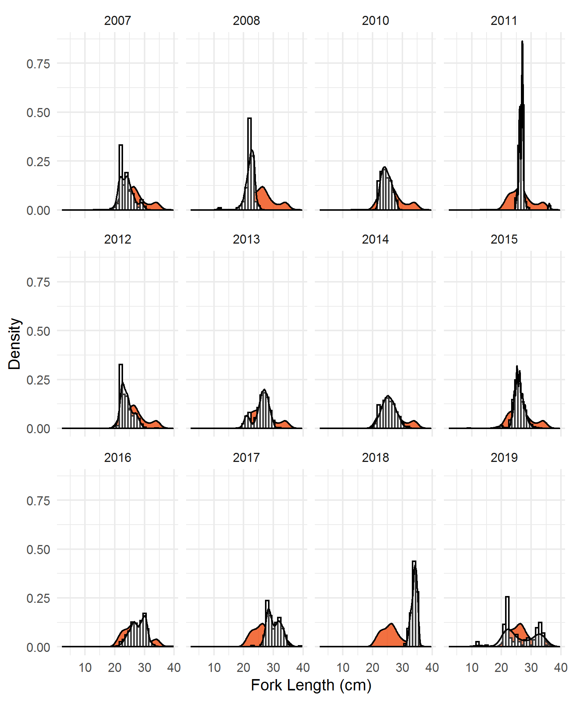
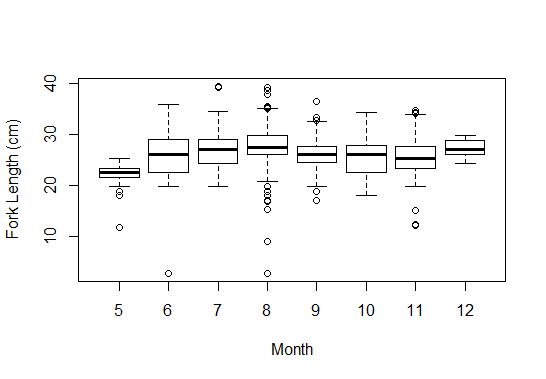

## Introduction

The objective of the project "Characterization of the Atlantic Chub Mackerel fishery and stock" is a continued effort to work with industry partners (J. Kaelin, Lund's Fisheries and M. Lapp, SeaFreeze Ltd.) to characterize the age and length composition of Atlantic Chub Mackerel(ACM) in the commercial fishery. To our knowledge, the data collected here are the only available for understanding the fishery dynamics of Chub Mackerel in the United States. Our work focuses on collecting length-compositon information from the two primary companies that target the stock. Both companies harvest ACM and Illex squid, and ACM is considered a secondary target and one of opportunity.

The collection of fishery-dependent data was initiated in 2016 using funding provided by the [Science Center for Marine Fisheries](www.scemfis.org/). SCeMFiS is a National Science Foundation Industry/University Cooperative Research Center (I/UCRC).

The intention of this work has been to understand inter-annual variations in age and length composition of ACM. In this report, we have integrated data collected this year with those collected by Leaf and from previous fishery-dependent sampling work (earlier than 2016) from the mid-Atlantic. SeaFreeze Ltd. has provided these data from random sampling of boxes of fish packed and frozen at sea. The intention of this effort is to contribute to a continued understanding of the length and age-composition of harvest and to expand the time series of annual length composition for inclusion into quantitative stock assessment.

## Methods

In 2019 to 2020, working with industry partners, we have requested that both SeaFreeze and Lund's Fisheries collect a random subset of the catch of ACM and keep them frozen at their facility, labeled with the date of collection. Depending on the volume of samples, we have made trips to Lund's Fisheries in the late summer/early fall to collect and sample fish (determine length, weight, and collect otoliths and gonads) onsite. In other years, including in 2019, we have requested that frozen samples be shipped to the Gulf Coast Research Laboratory, Ocean Springs, MS. This year (2019) the fishery did not encounter ACM until late in the season (Table 1) and these samples were collected by SeaFreeze Ltd.

\pagebreak

Table 1. Summary of sampling (month and year) performed by SeaFreeze Ltd. (2007 to 2015) and industry and academic cooperative partnership with Leaf's Laboratory at the Gulf Coast Research Laboratory and Lund's Fisheries and SeaFreeze Ltd. (2016 to 2019).

```{r monthly.summary, echo=FALSE, message=FALSE, warning=FALSE}
require(knitr)
require(kableExtra)
require(tidyverse)

course.eval <- read.csv("monthly.summary.stats.csv")
course.eval <- course.eval[,-1]

names(course.eval) <- c("Year", "Month", "Number of Fish Examined")
course.eval <- course.eval %>% group_by(Year) %>% summarise(`Month Start` = min(Month),
                                             `Month End` = max(Month), 
                                             `Number of Fish Examined` = sum(`Number of Fish Examined`))

knitr::kable(course.eval) %>%
 # column_spec(1, bold = T, width = "5em") %>%
  kable_styling(bootstrap_options = "striped", full_width = F, position = "center")
```

\pagebreak

Table 2. Summary statistics of sampling performed by SeaFreeze Ltd. (2007 to 2015) and cooperative partnership with the Gulf Coast Research Laboratory at the Univerisity of Southern Mississippi and Lund's Fisheries and SeaFreeze Ltd. (2016 to 2019). Note that 2016 does include some fish collected in the northern Gulf of Mexico (from fishery-dependent sampling) and included to show the scope of the sampling work in that year.

```{r sampling.summary, echo=FALSE, message=FALSE, warning=FALSE}
require(knitr)
require(kableExtra)
require(tidyverse)

course.eval <- read.csv("summary.stats.csv")
course.eval <- course.eval[,-1]

names(course.eval) <- c("Year",	"Minimum FL (cm)",	"Maximum FL (cm)", 
                        "# Fish Measured", "# Determine Maturity", 
                        "# Sex Deterimed", "# Age Determined")

knitr::kable(course.eval[,c(1,2,3,4,7)]) %>%
 # column_spec(1, bold = T, width = "5em") %>%
  kable_styling(bootstrap_options = "striped", full_width = FALSE, position = "center")
```

In 2016 to 2017 we focused our efforts on describing the length-at-age, weight-at-length, and maturity dynamics of Atlantic Chub Mackerel. These analysis have been published (Daley and Leaf, *J. Northw. Atl. Fish. Sci.*, 50: 1-12). In our most recent effort, in 2019, we continued to collect and characterize the length composition of Atlantic Chub Mackerel from the fishery. 

Based on aggregated length-composition information, of all years, the length composition exhibits a slight bimodal pattern with peaks at 25 cm TL and another at 32 cm TL. There is considerable variation in the patterns of annual length composition encountered in the commercial fishery and in general length composition data from a single year do not exhibit a bimodal pattern, instead, the mean of the annual length composition distributions are generally unimodal and either centered or skewed to smaller lengths (e.g. years 2007, 2008, 2012, 2018) or centered or skewed to larger lengths (e.g. years 2007, 2008, 2012, 2014).



However, the harvested fish in 2019, provided to us from SeaFreeze Ltd., exhibited a bimodal pattern. One trip in particular resulted in the harvest of small ACM, with a mean FL of approximately 22 cm. Large individuals, 30 to 35 cm, were also harvested as they have been nearly every year, since 2012 (Table 2).



Based on the historical analysis of length composition, there is no relationship between the month of harvest and the mean length of the fish encountered.
